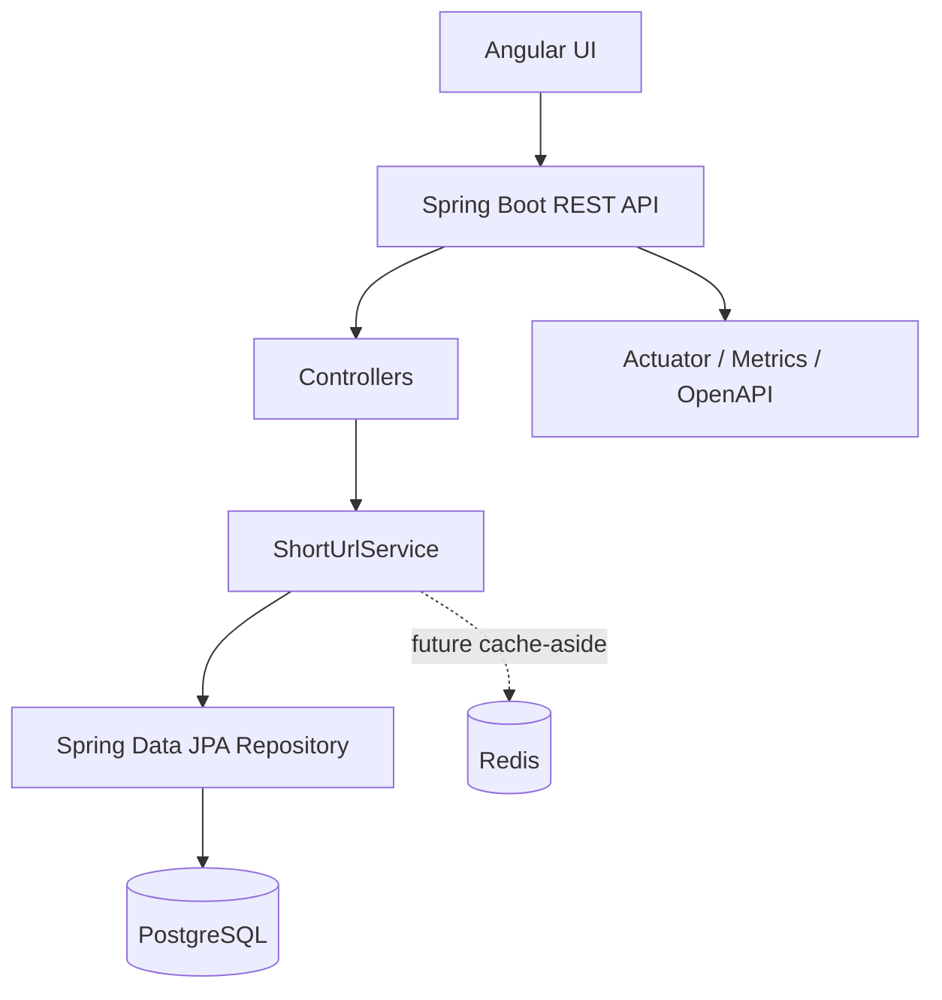

# Architecture Overview

## Decision
For a 2–3 day interview prototype, the preferred architecture is a **modular monolith**. It demonstrates clear boundaries without introducing the operational overhead of multiple independently deployed services.

## Request flows

### Create
1. Angular sends `POST /api/v1/urls`.
2. Bean validation checks required fields and size constraints.
3. Service validates that the destination is an absolute HTTP/HTTPS URI.
4. Service generates a 7-character Base62 code.
5. PostgreSQL persists the record under a unique constraint.
6. A collision is retried using a new code.
7. API returns HTTP 201 and a `Location` header pointing to the created short URL.

### Redirect
1. Client calls `GET /{code}`.
2. Service loads the code and checks expiration.
3. Click count is incremented with an atomic SQL update to avoid lost updates.
4. API returns HTTP 302 with the destination in the `Location` header.

### Analytics
Analytics currently returns aggregate click count and lifecycle timestamps. Per-event analytics is intentionally not implemented because the assignment does not define its required dimensions, retention, or privacy model.

## Scalability path
- Add Redis cache-aside for hot redirect reads.
- Emit redirect events asynchronously to Kafka for high-volume analytics.
- Store analytics events separately from transactional URL metadata.
- Add database indexes/partitioning based on measured access patterns.
- Introduce an API gateway for authentication, rate limiting and observability.

## Why not microservices?
The domain is small and the assignment prioritizes engineering judgment, testability and a runnable end-to-end prototype. Splitting this into services would add deployment, networking and consistency complexity without demonstrating additional value in the MVP.
