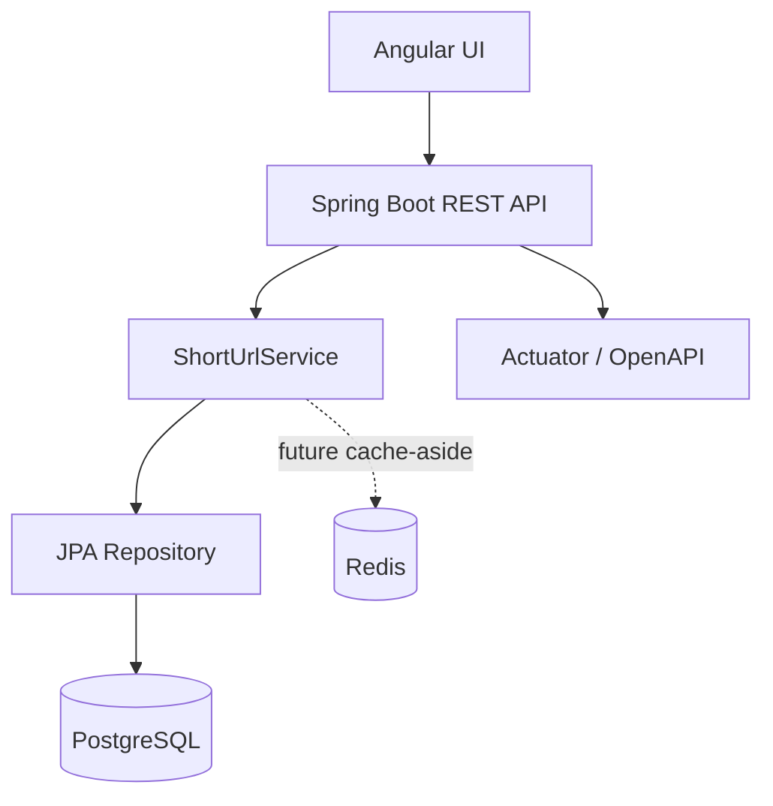

# AI-Assisted URL Shortener — Interview Submission

## Purpose

This repository is a production-oriented prototype for the supplied AI-proficient software engineering assignment. It demonstrates engineer-led execution accelerated by AI: requirement interpretation, task decomposition, implementation, testing, documentation, risk review and explicit human ownership.

## Technology

- **Backend:** Java 17, Spring Boot 3.5, Spring MVC, Bean Validation, Spring Data JPA
- **Database:** PostgreSQL 17
- **Cache:** Redis 7 infrastructure-ready; deliberately not a correctness dependency in the MVP
- **Frontend:** Angular 20, TypeScript
- **Testing:** JUnit 5, Mockito, Spring Boot Test, Testcontainers/PostgreSQL
- **Operations:** Actuator, OpenAPI/Swagger, Docker Compose

## Architecture



The architecture is intentionally a **modular monolith**. For a small two-to-three-day prototype, it provides clear separation of concerns while avoiding unnecessary distributed-system complexity.

See `docs/ARCHITECTURE.md` for detailed request flows and the scalability path.

## API

| Method | Endpoint | Purpose |
|---|---|---|
| POST | `/api/v1/urls` | Create a short URL |
| GET | `/{shortCode}` | Redirect to destination |
| GET | `/api/v1/urls/{shortCode}/stats` | Aggregate analytics |
| DELETE | `/api/v1/urls/{shortCode}` | Delete a short URL |
| GET | `/actuator/health` | Health check |
| GET | `/swagger-ui.html` | OpenAPI UI |

### Create example

```bash
curl -i -X POST http://localhost:8080/api/v1/urls \
  -H 'Content-Type: application/json' \
  -d '{"longUrl":"https://www.example.com/products/123","expirationHours":24}'
```

The API returns `201 Created` and a `Location` header containing the generated short URL.

## Local setup

### Prerequisites

- Java 17+
- Maven 3.9+
- Docker Desktop
- Node.js 20+

### Start dependencies

```bash
docker compose up -d postgres redis
```

### Run backend

```bash
cd backend
mvn clean verify
mvn spring-boot:run
```

Backend: `http://localhost:8080`  
Swagger: `http://localhost:8080/swagger-ui.html`  
Health: `http://localhost:8080/actuator/health`

### Run Angular

```bash
cd frontend
npm ci
npm start
```

Frontend: `http://localhost:4200`

The Angular development server proxies `/api` requests to the Spring Boot backend.

## Testing

Unit tests cover creation, URL validation, expiration, redirect behavior, atomic click counting and missing resources.

A Testcontainers integration test starts PostgreSQL and verifies the end-to-end create/redirect path. It requires Docker.

Recommended quality gate:

```bash
cd backend
mvn clean verify
```

Frontend quality gate:

```bash
cd frontend
npm ci
npm run build
```

## AI-assisted engineering evidence

The assignment's differentiator is not simply using AI to generate code. The submission documents how AI was used inside engineer-owned tasks and where generated suggestions were modified or rejected.

- `docs/AI_EXECUTION_LOG.md` — task intent, constraints, acceptance criteria, AI assistance and engineer decisions.
- `docs/ENGINEERING_SUMMARY.md` — final rationale, scenarios, risks and limitations.
- `docs/DEMO_SCRIPT.md` — suggested interview walkthrough.
- `docs/SECURITY_REVIEW.md` — security and reliability assessment.

## Three required scenarios

### Greenfield
Build URL creation and redirect from scratch, including validation, persistence, collision handling and tests.

### Brownfield
Add Redis cache-aside to high-frequency redirect reads after measuring baseline performance. The change includes cache invalidation, expiration handling and regression/performance tests.

### Ambiguous
Interpret “provide analytics” and explicitly identify questions about unique users, dimensions, real-time behavior, retention and privacy. The MVP chooses aggregate click count only until those requirements are clarified.

## Security and reliability

- HTTP/HTTPS-only destination validation
- Input size limits
- Bounded expiration range
- Database uniqueness as final collision guard
- Bounded collision retries
- Atomic click counter update
- Structured 400/404/500 responses
- No server-side fetch of destination URLs
- Environment-based database credentials
- Actuator health/metrics

## Production hardening intentionally documented

This interview prototype does not pretend to be a complete internet-scale service. A production rollout should add Flyway/Liquibase migrations, authentication/authorization, rate limiting and abuse controls, TLS/API gateway controls, centralized structured logging, SAST/SCA gates, and a separate event-driven analytics pipeline at high volume.

## Submission note

Run the commands in `SUBMISSION_CHECKLIST.md` on a Docker-enabled development machine before submitting. Do not claim a successful build/test result until it has actually been executed.
